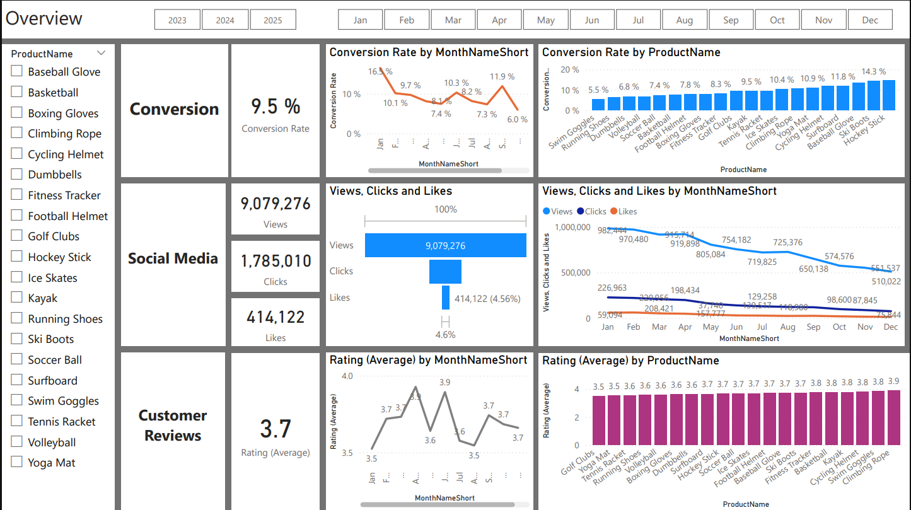
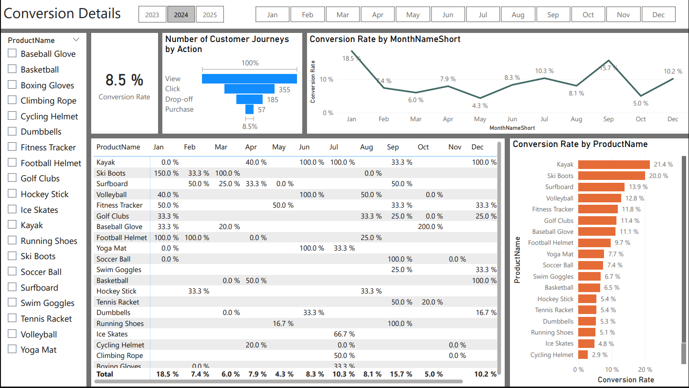
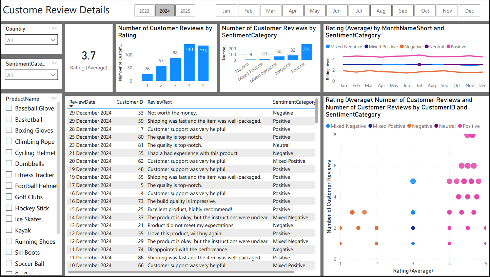
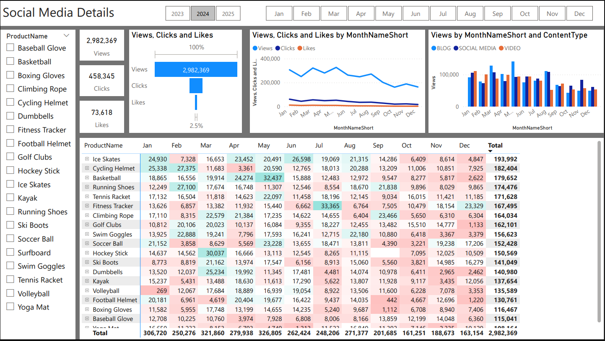

## ShopEasy Conversion Analysis Dashboard 

## Executive Summary
This report provides an in-depth analysis of customer engagement and Feedback.

## Overview

##  Conversion Details

## Customer Review Details 

## Social Media Details

## Task
Personal project for a company called ShopEasy.

## The report addresses the following key questions:
Reduced Customer Engagement: The number of customer interactions and engagement with the site and marketing content has declined.
Decreased Conversion Rates: Fewer site visitors are converting into paying customers.
High Marketing Expenses: Significant investments in marketing campaigns are not yielding expected returns.
Need for Customer Feedback Analysis: Understanding customer opinions about products and services is crucial for improving engagement and conversions.

## Tools Used
SQL :  for preliminary data exploration, cleaning the data, Extract and query the relevant data from the dataset.
Power BI Desktop: for creating dynamic and interactive visualizations to present the findings effectively.

## Data Sources
www.kaggle.com

## Key Findings
Decreased Conversion Rates: The conversion rate demonstrated a strong rebound in December, reaching 10.2%, despite a notable dip to 5.0% in October.
Reduced Customer Engagement:
There is a decline in overall social media engagement, with views dropping throughout the year.
While clicks and likes are low compared to views, the click-through rate stands at 15.37%, meaning that engaged users are still interacting effectively.
Customer Feedback Analysis:
Customer ratings have remained consistent, averaging around 3.7 throughout the year.
Although stable, the average rating is below the target of 4.0, suggesting a need for focused improvements in customer satisfaction, for products below 3,5.

